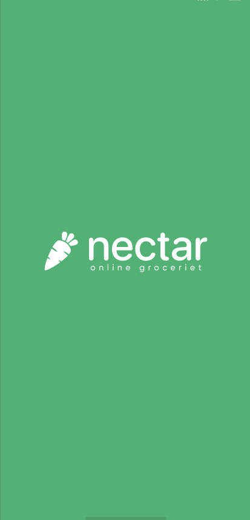
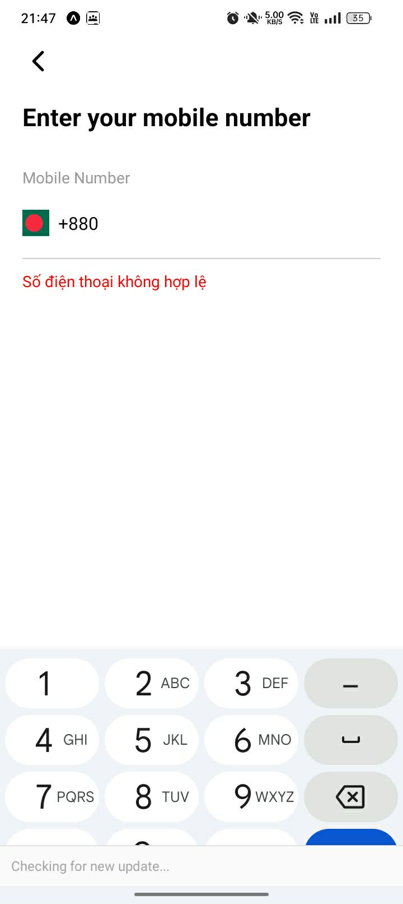
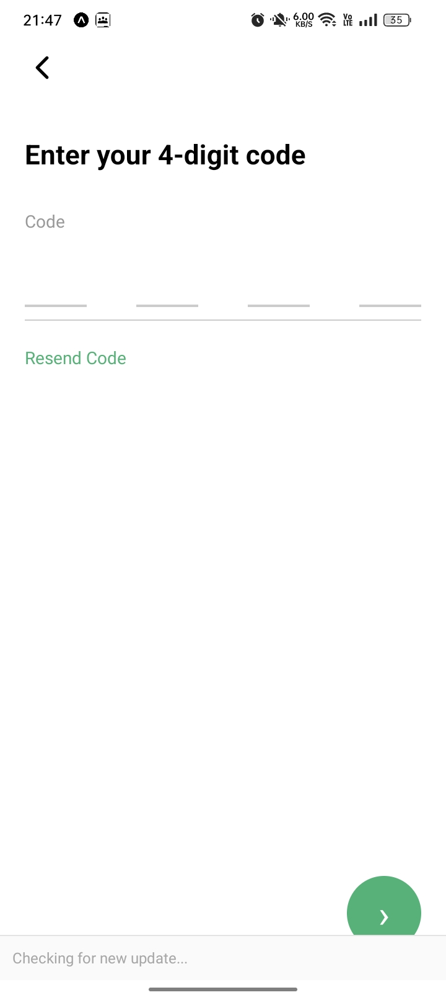
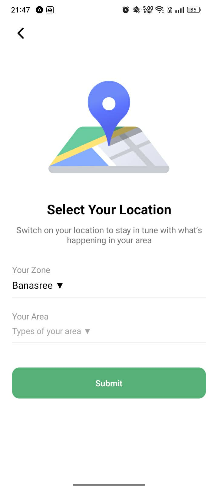
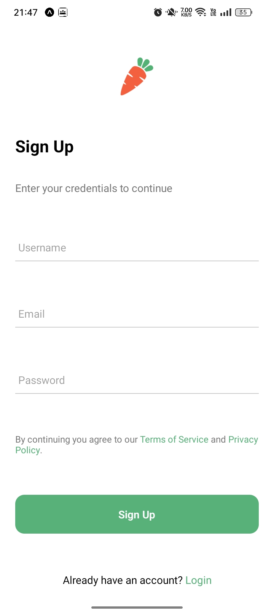

# Nectar App (React Native - Expo)

- Sinh viên thực hiện: Nguyễn Đình Lộc
- Mã Sinh viên: 23810310244

## Giới thiệu

Ứng dụng mobile mô phỏng app mua sắm (Nectar app) được xây dựng bằng **React Native + Expo**.
App bao gồm đầy đủ các flow cơ bản:

- Splash Screen
- Onboarding
- Authentication (Sign In / Sign Up / OTP)
- Select Location
- UI hiện đại, tối giản

---

## Hướng dẫn chạy app

### Yêu cầu

- Node.js >= 16
- npm hoặc yarn
- Expo CLI

---

### Cài đặt

```bash
git clone https://github.com/dinhlocnguyen14/NectarApp
cd NectarApp
npm install
```

---

### Chạy app

```bash
npx expo start
```

Sau đó:

- Nhấn `a` để chạy Android Emulator
- Nhấn `w` để chạy trên Web
- Hoặc quét QR bằng app **Expo Go** trên điện thoại

---

## Ảnh demo

### 🔹 Splash Screen



### 🔹 Onboarding


### 🔹 Sign In


### 🔹 Number



### 🔹 Verification



### 🔹 Location



### 🔹 Sign Up

## 

## Video demo

👉 Xem demo tại đây:
https://drive.google.com/file/d/1mwzup4vmn_rhz2YdDUQQ0vVgIh5f6o-X/view?usp=sharing

---

## Công nghệ sử dụng

- React Native (Expo)
- React Navigation
- Expo Vector Icons

---

## Ghi chú

- Đây là project học tập / demo
- Có thể mở rộng thêm:
  - Firebase Authentication
  - Backend API
  - Redux / Context
  - Payment

---
