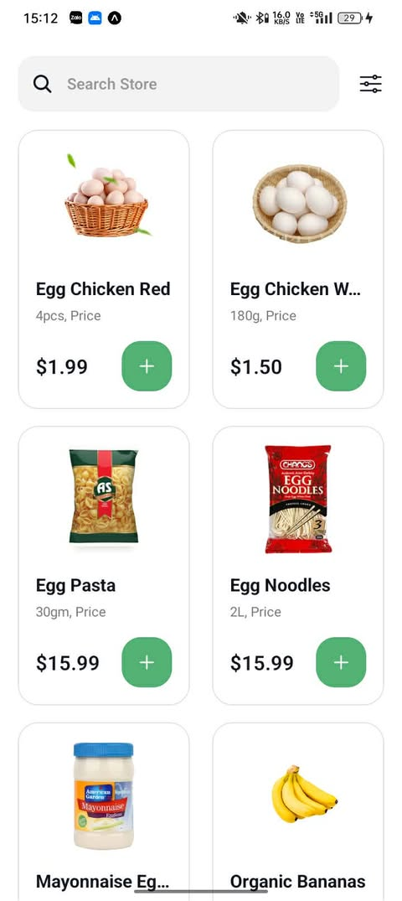
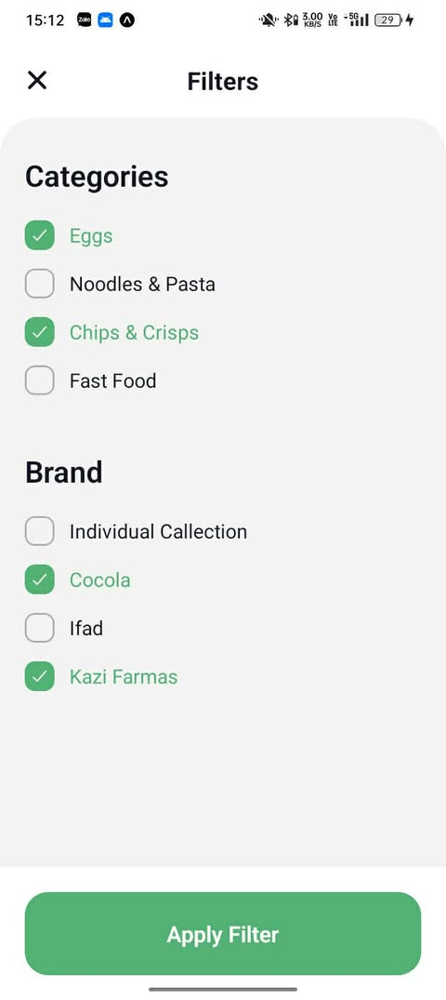
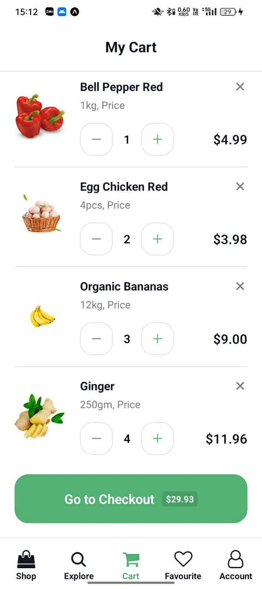
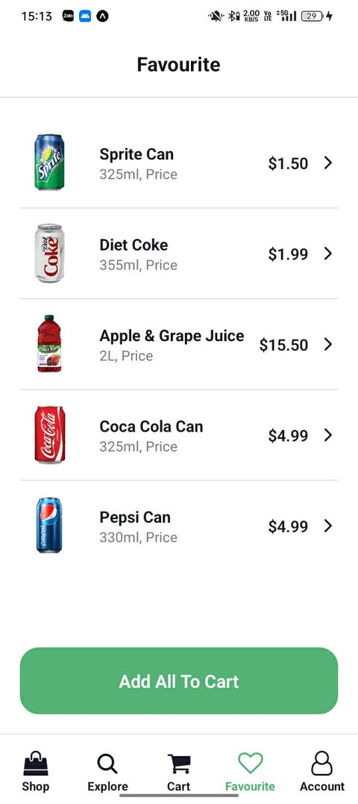
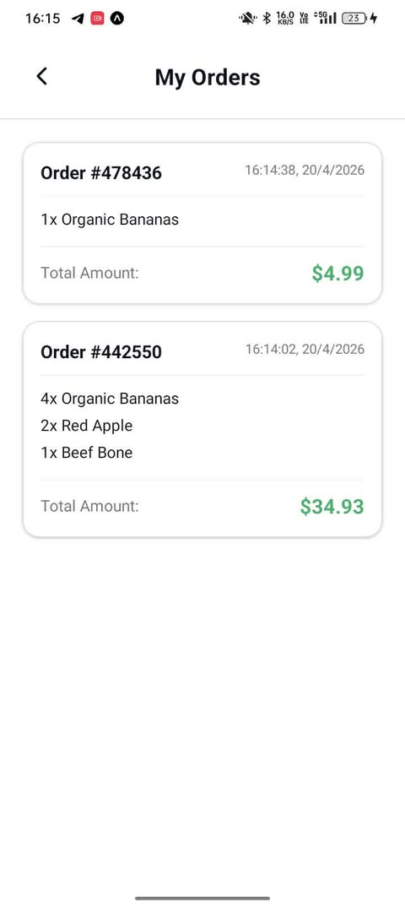
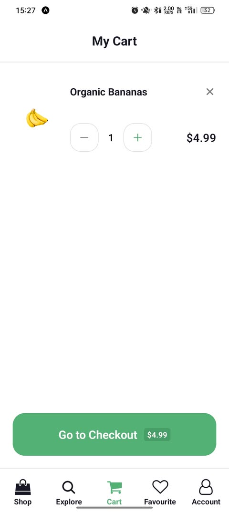
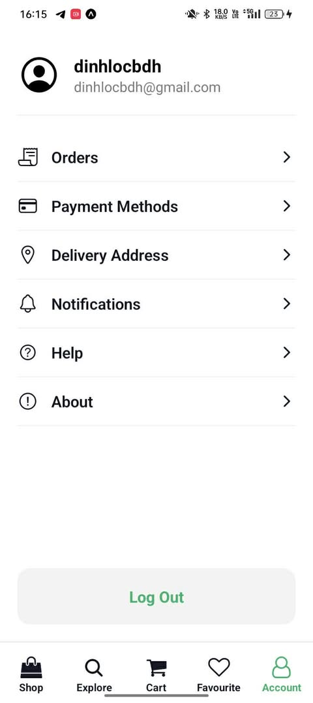
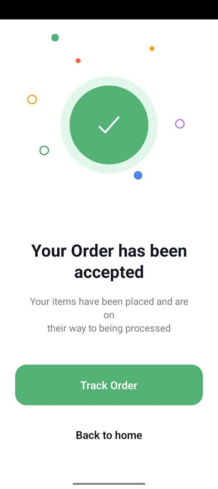

# Nectar App (React Native - Expo)

## Thông tin sinh viên

- Họ tên: Nguyễn Đình Lộc
- MSSV: 23810310244

---

## Giới thiệu

Nectar App là ứng dụng mobile mô phỏng hệ thống mua sắm hiện đại, được xây dựng bằng React Native và Expo.

Ứng dụng tập trung vào:

- Trải nghiệm người dùng mượt mà
- Flow rõ ràng
- Giao diện tối giản, hiện đại

---

## Hướng dẫn chạy app

### Yêu cầu

- Node.js >= 16
- npm hoặc yarn
- Expo CLI

### Cài đặt

```bash
git clone https://github.com/dinhlocnguyen14/NectarApp
cd NectarApp
npm install
```

### Chạy ứng dụng

```bash
npx expo start
```

- Nhấn `a` để chạy Android
- Nhấn `w` để chạy Web
- Hoặc dùng Expo Go quét QR

---

## Demo giao diện

### Nhóm 1

| Splash                                       | Onboarding                                       | Sign In                                      |
| -------------------------------------------- | ------------------------------------------------ | -------------------------------------------- |
|  |  |  |

### Nhóm 2

| Number                                       | Verification                                       | Location                                       |
| -------------------------------------------- | -------------------------------------------------- | ---------------------------------------------- |
|  |  |  |

### Nhóm 3

| Sign Up                                      | Login                                       | Home                                             |
| -------------------------------------------- | ------------------------------------------- | ------------------------------------------------ |
|  |  |  |

### Nhóm 4

| Product Detail                                      | Explore                                       | Beverages                                       |
| --------------------------------------------------- | --------------------------------------------- | ----------------------------------------------- |
|  |  |  |

### Nhóm 5

| Search                                       | Filter                                       | Cart                                       |
| -------------------------------------------- | -------------------------------------------- | ------------------------------------------ |
|  |  |  |

### Nhóm 6

| Favorite                                       |
| ---------------------------------------------- |
|  |

### Nhóm 7

| Order                                       | MyCart                                       | Account                                       | Checkout                                       |
| ------------------------------------------- | -------------------------------------------- | --------------------------------------------- | ---------------------------------------------- |
|  |  |  |  |

---

## Video demo

https://drive.google.com/file/d/1mwzup4vmn_rhz2YdDUQQ0vVgIh5f6o-X/view

# 20/4

https://drive.google.com/file/d/1MHUgBbZKxk5MSkvT9qzqstbHZg9hOIv3/view?usp=drive_link

---

## Công nghệ sử dụng

- React Native (Expo)
- React Navigation
- Expo Vector Icons

---

## AsyncStorage, State và Context API

### AsyncStorage hoạt động như thế nào

AsyncStorage là hệ thống lưu trữ key-value bất đồng bộ trong React Native.

- Lưu dữ liệu dạng key - value
- Hoạt động bất đồng bộ (async/await)
- Lưu trực tiếp trên thiết bị
- Không mất khi tắt ứng dụng

Ví dụ:

```js
import AsyncStorage from "@react-native-async-storage/async-storage";

await AsyncStorage.setItem("userToken", "abc123");
const token = await AsyncStorage.getItem("userToken");
await AsyncStorage.removeItem("userToken");
```

---

### Vì sao dùng AsyncStorage thay vì state

State:

- Chỉ tồn tại trong runtime
- Mất khi reload app

AsyncStorage:

- Lưu lâu dài
- Dùng cho token, user info, cache

Kết luận:

- State dùng cho UI
- AsyncStorage dùng cho dữ liệu lâu dài

---

### So sánh với Context API

Context API giúp chia sẻ dữ liệu giữa nhiều component.

| Tiêu chí     | AsyncStorage     | Context       |
| ------------ | ---------------- | ------------- |
| Mục đích     | Lưu trữ dữ liệu  | Chia sẻ state |
| Lưu lâu dài  | Có               | Không         |
| Tốc độ       | Chậm hơn (async) | Nhanh         |
| Re-render UI | Không            | Có            |

---

### Cách kết hợp thực tế

- App khởi động: load từ AsyncStorage
- Đưa dữ liệu vào Context
- UI sử dụng Context
- Khi thay đổi: update Context và lưu lại AsyncStorage

---

## Best Practices

- Không lưu dữ liệu nhạy cảm dạng plain text
- Không lạm dụng Context
- Tách rõ storage, state và UI
- Đồng bộ dữ liệu giữa Context và AsyncStorage

---

## Tổng kết

Project đã hoàn thiện UI và flow cơ bản.

AsyncStorage, State và Context cần được sử dụng đúng vai trò để đảm bảo ứng dụng ổn định, dễ mở rộng và dễ bảo trì.

Ứng dụng có thể phát triển thêm với backend, authentication và các tính năng nâng cao khác.
