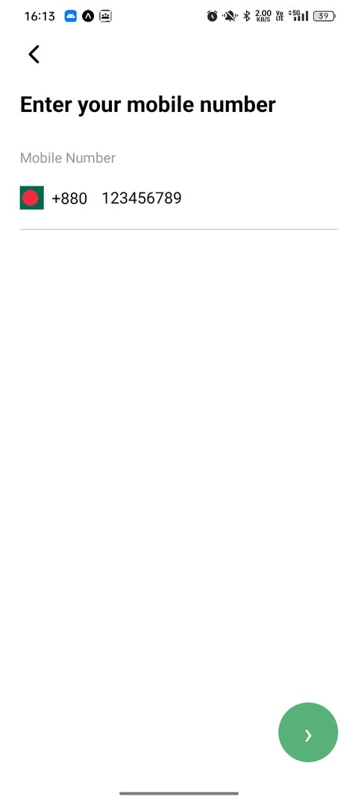
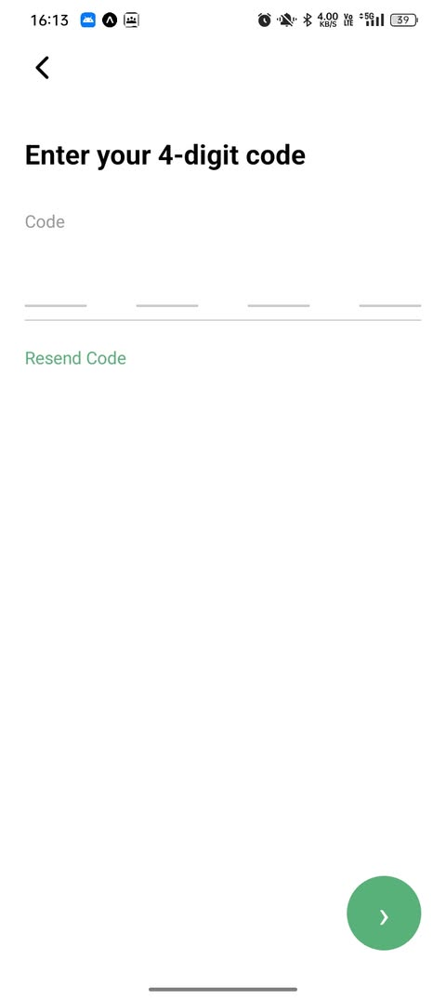
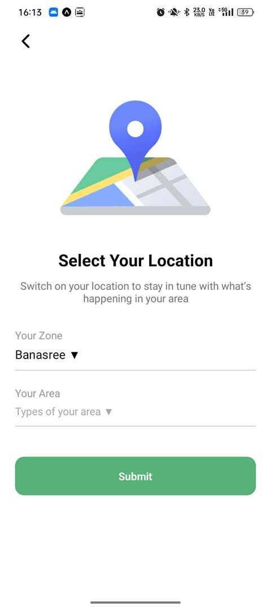
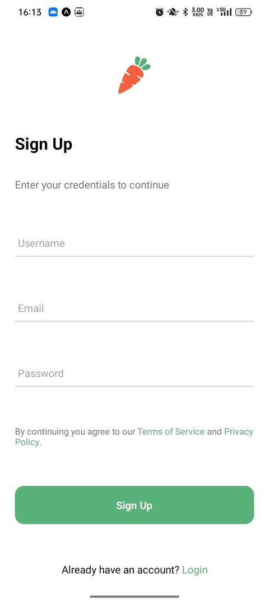
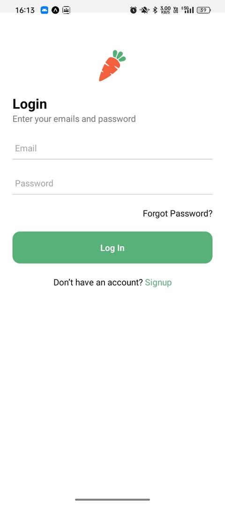
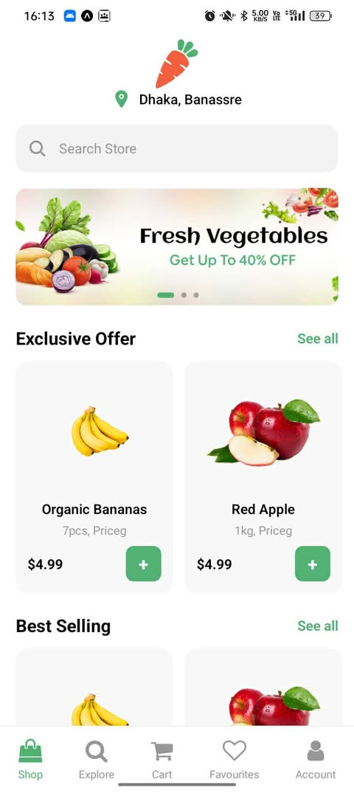
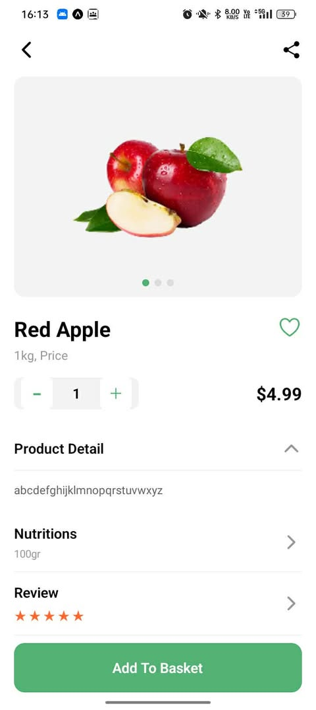
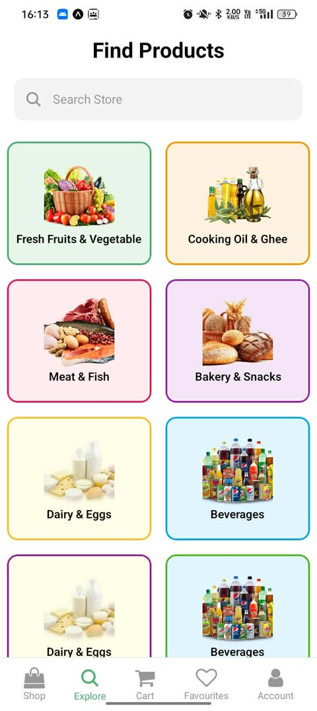
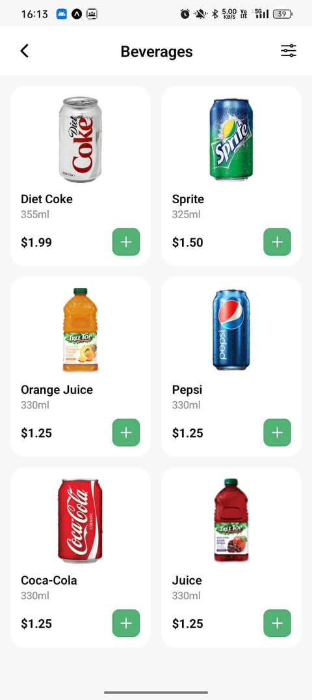

# Nectar App (React Native - Expo)

## 👨‍💻 Thông tin sinh viên

- **Họ tên:** Nguyễn Đình Lộc
- **MSSV:** 23810310244

---

## 📌 Giới thiệu

Nectar App là ứng dụng mobile mô phỏng hệ thống mua sắm hiện đại, được xây dựng bằng **React Native + Expo**.

Ứng dụng tập trung vào:

- Trải nghiệm người dùng mượt mà
- Flow rõ ràng
- Giao diện tối giản, hiện đại

---

## 🚀 Hướng dẫn chạy app

### 🔧 Yêu cầu

- Node.js >= 16
- npm hoặc yarn
- Expo CLI

---

### 📥 Cài đặt

```bash
git clone https://github.com/dinhlocnguyen14/NectarApp
cd NectarApp
npm install
```

---

### ▶️ Chạy ứng dụng

```bash
npx expo start
```

- Nhấn `a` → Android
- Nhấn `w` → Web
- Hoặc dùng Expo Go quét QR

---

## 📸 Demo giao diện

### 🔹 Nhóm 1

| Splash                                       | Onboarding                                       | Sign In                                      |
| -------------------------------------------- | ------------------------------------------------ | -------------------------------------------- |
|  |  |  |

---

### 🔹 Nhóm 2

| Number                                       | Verification                                       | Location                                       |
| -------------------------------------------- | -------------------------------------------------- | ---------------------------------------------- |
|  |  |  |

---

### 🔹 Nhóm 3

| Sign Up                                      | Home                                        | Explore                                          |
| -------------------------------------------- | ------------------------------------------- | ------------------------------------------------ |
|  |  |  |

---

### 🔹 Nhóm 4

| Product Detail                                      | Beverages                                     |                                                 |
| --------------------------------------------------- | --------------------------------------------- | ----------------------------------------------- |
|  |  |  |

---

## 🎬 Video demo

https://drive.google.com/file/d/1mwzup4vmn_rhz2YdDUQQ0vVgIh5f6o-X/view

---

## 🛠️ Công nghệ sử dụng

- React Native (Expo)
- React Navigation
- Expo Vector Icons

---

## 📌 Ghi chú

- Đây là project học tập / demo
- Có thể mở rộng:
  - Firebase Authentication
  - Backend API
  - State Management
  - Thanh toán

---

## ⭐ Tổng kết

Project đã hoàn thiện UI và flow cơ bản.  
Có thể phát triển thêm để trở thành ứng dụng hoàn chỉnh.
